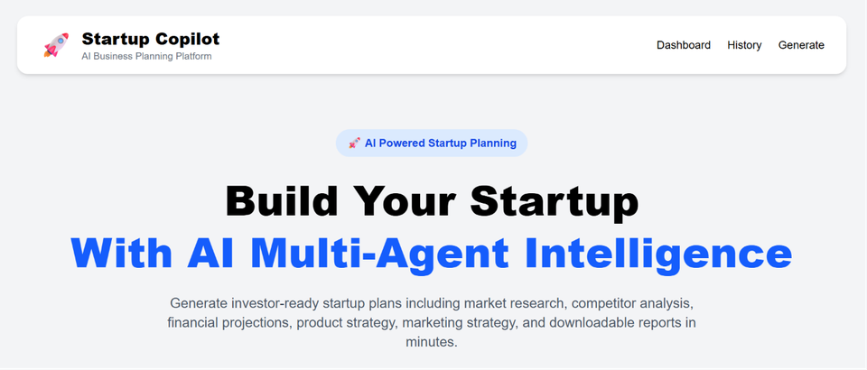
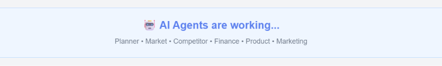

# 🚀 Startup Copilot

An AI-powered multi-agent startup planning platform that transforms a startup idea into a complete business plan using multiple AI agents. The application generates market research, competitor analysis, financial planning, product strategy, marketing strategy, and downloadable PDF reports.

---

## ✨ Features

- 🤖 AI Multi-Agent Workflow using LangGraph
- 📊 Market Analysis
- 🏢 Competitor Analysis
- 💰 Financial Planning
- 📦 Product Strategy
- 📢 Marketing Strategy
- ⭐ Startup Scoring & Recommendation
- 🔐 Google Authentication using Firebase
- 📄 PDF Report Generation
- 📂 Startup History
- 🔍 Search Startup Plans
- 📈 Financial Dashboard & Charts
- 🎨 Modern Responsive UI

---

## 🛠 Tech Stack

### Frontend
- React.js
- Tailwind CSS
- Axios
- Recharts
- Firebase Authentication
- React Toastify

### Backend
- FastAPI
- LangGraph
- LangChain
- Gemini API
- SQLAlchemy
- SQLite
- ReportLab

---

## 🏗 Project Architecture

```
React Frontend
       │
       ▼
FastAPI Backend
       │
       ▼
LangGraph Workflow
       │
 ┌───────────────┐
 │ Planner Agent │
 └───────────────┘
        │
        ▼
 Market Agent
        │
        ▼
 Competitor Agent
        │
        ▼
 Finance Agent
        │
        ▼
 Product Agent
        │
        ▼
 Marketing Agent
        │
        ▼
 Report Agent
        │
        ▼
 SQLite Database
        │
        ▼
 PDF Generator
```

---

# 📸 Screenshots

## 🏠 Home Page



---

## 🔐 Google Authentication


---

## 💡 Startup Idea


---

## 🤖 AI Processing



---

## 📊 Generated Report


---

## 📂 Startup History


---

## 📄 PDF Report


---

# 🚀 Installation

## Clone Repository

```bash
git clone https://github.com/SyedAmeena23/startup-copilot.git
```

```bash
cd startup-copilot
```

---

## Backend

```bash
cd backend
```

Install dependencies

```bash
pip install -r requirements.txt
```

Create `.env`

```env
GEMINI_API_KEY=YOUR_API_KEY
```

Run server

```bash
uvicorn main:app --reload
```

---

## Frontend

```bash
cd frontend
```

Install packages

```bash
npm install
```

Run

```bash
npm run dev
```

---

# 📁 Folder Structure

```
startup-copilot/

├── backend/
│   ├── agents/
│   ├── database/
│   ├── graph/
│   ├── services/
│   ├── pdf_generator.py
│   ├── main.py
│   └── requirements.txt
│
├── frontend/
│   ├── src/
│   ├── components/
│   ├── firebase/
│   └── package.json
│
├── screenshots/
│
└── README.md
```

---

# ⭐ Workflow

1. User enters a startup idea.
2. Planner Agent creates the execution plan.
3. Market Agent performs market analysis.
4. Competitor Agent analyzes competitors.
5. Finance Agent estimates investment, revenue, expenses, and profit.
6. Product Agent creates the product roadmap.
7. Marketing Agent generates marketing strategies.
8. Report Agent combines all outputs into a final business report.
9. Report is stored in the database.
10. User can download the report as a PDF.

---

# 🚀 Future Improvements

- PostgreSQL Database
- Docker Support
- AI Chat Assistant
- Business Model Canvas
- Investor Pitch Deck Generator
- Team Collaboration
- Export to Word & PowerPoint
- Cloud Deployment

---

# 👩‍💻 Author

**Syed Ameena**

- GitHub: https://github.com/SyedAmeena23
- LinkedIn: https://www.linkedin.com/in/ameenasyed2323/

---

## ⭐ If you found this project useful, consider giving it a star on GitHub!